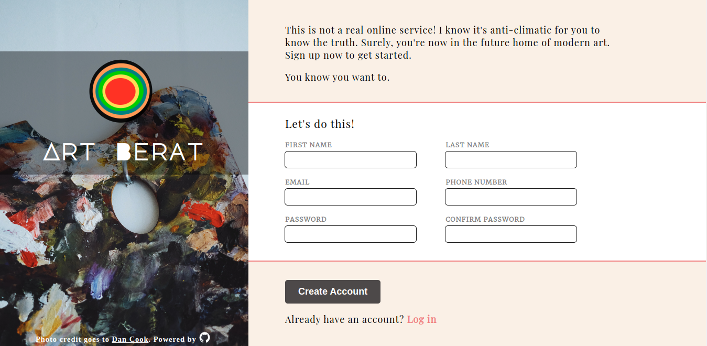

# Sign Up Form
> The main reason of this repo is to create a sign up form that is visually attractive.
> Live demo [_here_](https://nabelk.github.io/sign-up-form/).

## Table of Contents
* [General Info](#general-information)
* [Technologies Used](#technologies-used)
* [Features](#features)
* [Screenshots](#screenshots)
* [Contact](#contact)

## General Information
- The project is a part of The Odin Project: Full Stack JavaScript.
- It was designed to provide relevant experiences to users when signing up form.
- I undertake the project is to understand the structures of form and proper CSS styling.

## Technologies Used
#### HTML
SVG is include in this project for consistent quality when resize.

#### CSS 
Implementing css variables & function, viewport & rem unit, advanced selector and position make the whole process smoother. 

#### JS

## Features
- Responsive web design(desktop, mobile and tablet)
- Disable submit button after sending the valid form to prevent multiple submission. 
- Create a logic to match password fields.

## Screenshots

## Contact
Created by [@nabelk](https://www.linkedin.com/in/nabil-khalid-36791a241/) - feel free to contact me!